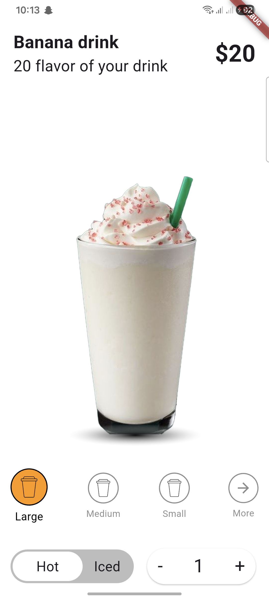
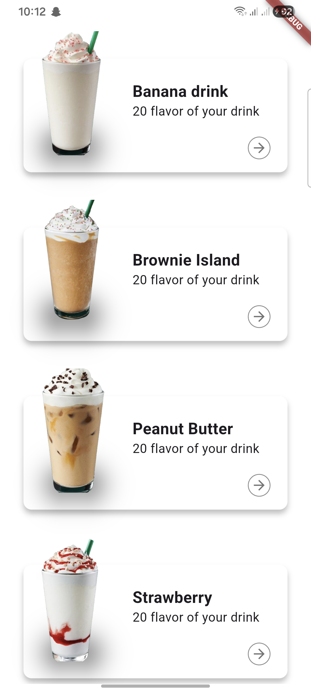

# ☕ Espresso App

Espresso is a modern Flutter application focused on delivering a clean, smooth, and visually appealing user experience.  
The app showcases images and video content with a simple structure and elegant UI, making it perfect as a demo, UI showcase, or starter project.

---

## 📖 Overview

This project is built using **Flutter** and **Dart**, following clean code principles and a responsive design approach.  
It highlights multimedia integration (images & video) while keeping performance and simplicity in mind.

---

## 🎬 Preview

### 📸 Screenshots
> Replace the paths below with your actual image paths.

  


### 🎥 Demo Video
> You can link a local video file or an online video (Drive, YouTube, etc.)

[Watch Demo Video](assets/video.mp4)

---

## ✨ Features
- Clean and modern UI  
- Responsive layout for different screen sizes  
- Image display support  
- Video playback support  
- Smooth user experience  

---

## 🛠️ Built With
- **Flutter**
- **Dart**

---

## 🚀 Getting Started

To run this project locally:

### Prerequisites
- Flutter SDK installed  
- Dart SDK  
- Android Studio / VS Code (optional)

### Installation

```bash
flutter pub get
flutter run
